# OS_Lab1

## Part 1 Process

---

运行课本 p103 3.7 的程序，结果如下

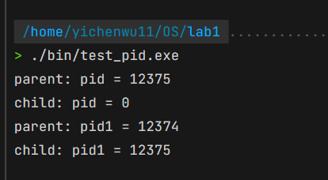

可以看出父进程和子进程是并发执行的，在父进程中 `fork()` 的返回值是子进程的pid，而在子进程中 `fork()` 的返回值是0

去除 `wait(NULL)` 后，并让父进程 `sleep(20)`, 然后运行程序，可以看到，子进程运行结束后由于父进程没有执行 `wait()`, 因此其变成了僵尸进程(Z+)

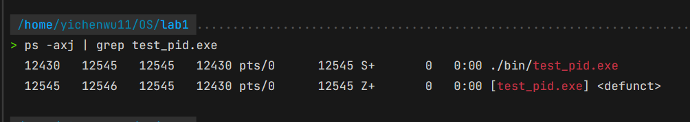

---

在程序中添加一个全局变量
```cpp
    int global = 0;
```

在父进程中
```cpp
    global += 2;
```

在子进程中
```cpp
    global += 1;
```

并打印输出 `global` 的值如下:

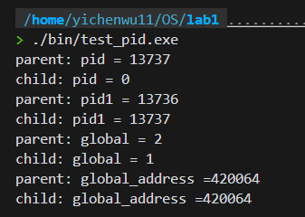

可以看到父进程和子进程中的值并不相同，即这两个 `global` 并不是同一个变量。但是它们的地址却一致，这是因为此地址仅为 `global` 在其各自的进程地址空间内的相对地址。而子进程是从父进程 `fork()` 而来的，因此他们的 `global` 的相对地址也一致.

---

在 `return` 前对 `global` 操作
```cpp
    global += 1;
    printf("final: global = %d\n", global);
```

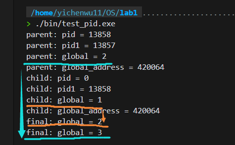

可以看出父子进程分别对其各自的变量进行了 +1 操作.

---

### **exec**

在子进程中开始处调用 `execl("./bin/hello_world.exe",NULL);`, 此处的 `"./bin/hello_world.exe"` 的作用是输出 helloworld 和进程的 pid 值.
</br>
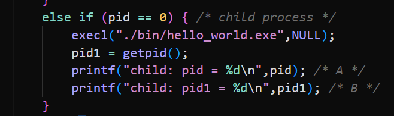
结果如下:
</br>
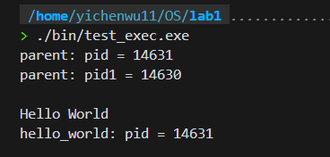

可以看到子进行直接去执行了 `hello_world.exe`，不会执行源程序中打印 pid 的部分.

如果我们换成在子进程的末尾处调用，则:
</br>
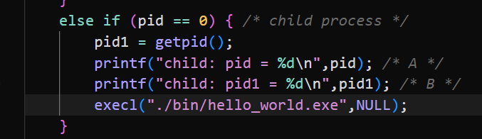
结果如下:
</br>
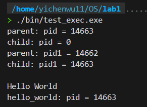

则子进程会把原来进程中打印 pid 的部分执行完再去执行 `hello_world.exe`, 这两项工作都是在同一个进程(子进程)中进行的(两次打印的 pid 值相同)

---

### **system**

同 exec，在子进行的开始处调用 `system("./bin/hello_world.exe");`, `hello_world.exe`的作用同上。
</br>
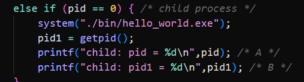
结果如下:
</br>
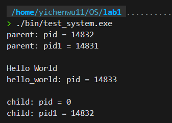

可以看到子进程先执行了 `hello_world.exe`，在执行了源代码中的打印 pid 值。不同之处在于, `system(...)` 内实际上调用了一次 `fork()`,也就是子进程创建出来一个自己的子进程，父进程的"子子进程"去执行 `hello_world.exe` (因为 `hello_world.exe` 中输出的 pid 不同于 子进程执行源程序时输出的 pid).

把 `system("./bin/hello_world.exe");` 放到子进程末尾
</br>
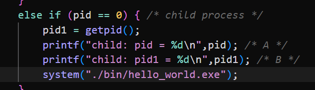
结果如下:
</br>
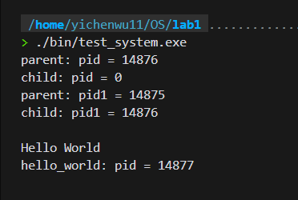

区别不大，仅仅是 `hello_world` 和打印 pid 的顺序变了而已, 这是理所当然的.

---

## Part 2 Thread

--- 
创建两个线程，并在其中对全局变量 `sum` 执行 5000 次不同操作

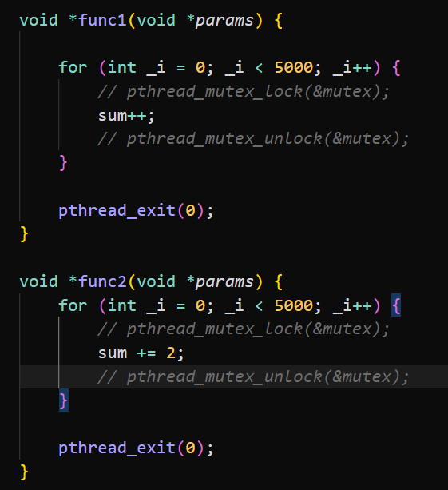

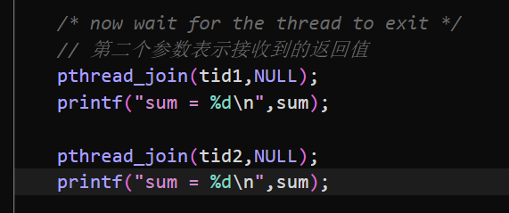

调用 `pthread_join(tid, NULL)` 对两个线程进行阻塞等待，并在结束后分别打印 `sum` 的值，结果如下:

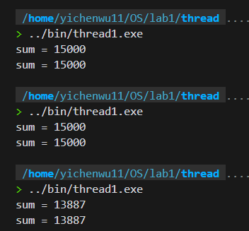

可以看到 `sum` 在有时候并没有按预期被加到 15000.
再将程序修改为在两个线程都结束后再打印 `sum`.

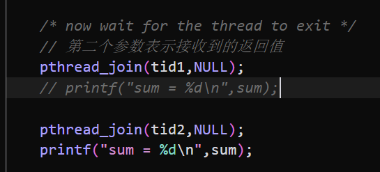

运行结果还是在有时候加不到 15000.

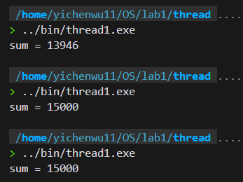

初步分析原因在于两个线程都要修改全局变量 `sum`, 即就是进入临界区，但是由于没有进行互斥，因此对 `sum` 的操作有些并没有生效. 因此考虑给两个线程加锁如下：

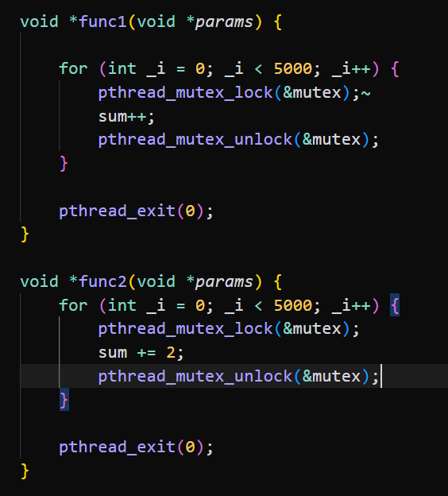

再次运行后可以看到每次输出都是两个 15000 了

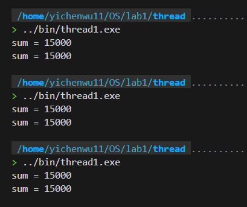

---

修改 Part1 中 exec 和 system 部分的代码改为在线程中执行.

### exec

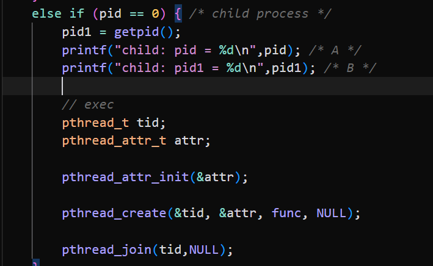

线程中执行以下代码,输出 tid 值, 然后执行进程切换去执行 `hello_world.exe`, 其作用是输出 pid 和 hello_world.

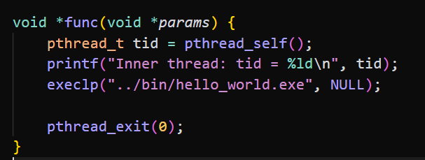

运行结果如下, 可以看到子进程创建了一个线程.

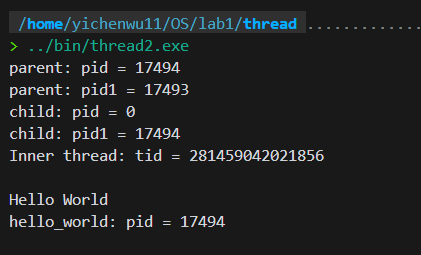

同 Part1，我们把线程创建和执行放到源程序的开头.

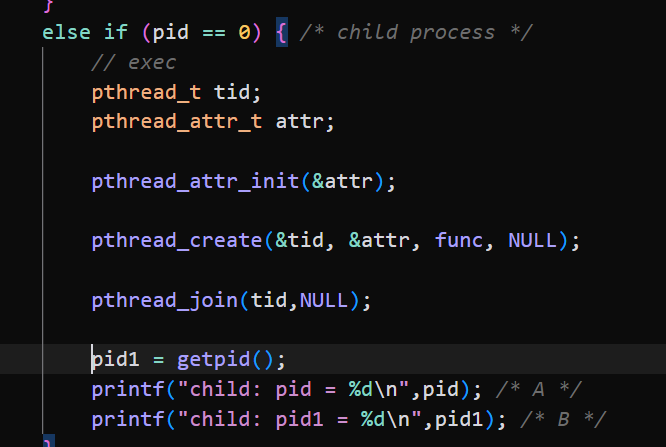

运行结果如下, 可以看到在子进程的线程中进行了进程切换, 因此源代码中两个打印 `pid` 的内容就不会被执行了.

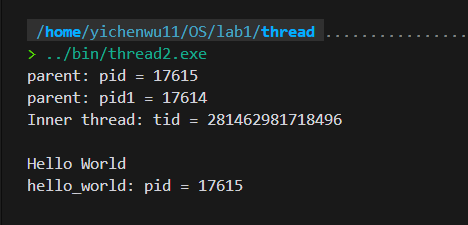

---

### system

同 `exec`. 在子进程中创建一个线程.

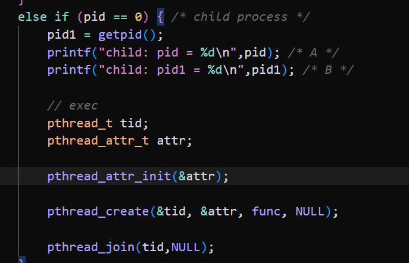

线程中执行以下代码.

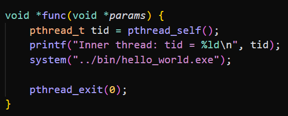

运行结果如下, 可以看到在子进程中进行了 `system(...)` 的调用后, 子进程调用 `fork()` 创建了一个自己的子进程，然后让这进程执行进程切换去执行 `hello_world.exe`. 可以看到在 `hello_world.exe` 中输出的 pid 和 子进程中 pid 并不相同.

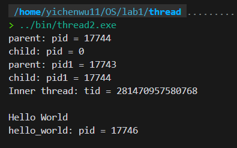

同 Part1，我们把线程创建和执行放到源程序的开头. 但对于 `system()` 来说，并不会像 `exec()` 一样，只是输出的顺序改变了.

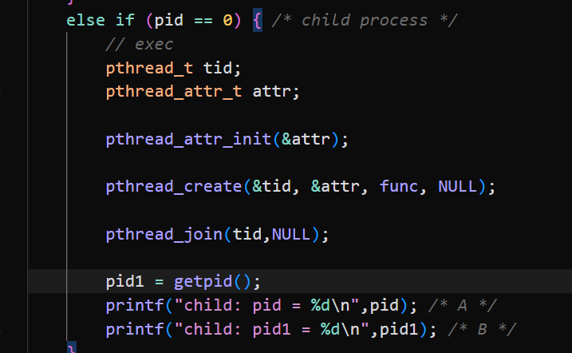

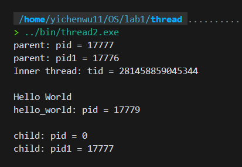

---

## Part 3 遇到的问题

在使用 vscode-remote 连接华为云时, 连接失败. 查看 vscode-remote 的输出日志可以看出一直在报这句错:

```shell
open failed: administratively prohibited: open failed
```

最后根据这篇 StackOverflow 上的回答解决了.
<br>
[vs-code-remote-ssh-failed-to-set-up-socket-other-clients-are-ok.](https://stackoverflow.com/questions/64941796/vs-code-remote-ssh-failed-to-set-up-socket-other-clients-are-ok)

---

## Part 4 分析和思考

* 计算机科学与技术即重科学也重技术，在课本上学来的理论知识，只有通过实际 Code 才能深入理解，掌握其用法

* 多线程可以充分利用 CPU 资源，可以使得有及时的响应不至于让用户一直进行等待, 无论是在 Graphics 领域加速运算还是在Web开发中处理传来的 request 并给出相应的 response 都有很大的作用。但是在 Part2 中可以看到多线程在没有考虑互斥和同步或者考虑不当的情况下往往会出现意想不到的结果，而且难以调试。即使现在有很多多线程的库，但在使用多线程时还是要多加小心，合适处理同步和互斥。


