# OS_Lab2

## Part1 IPC

---

### 软中断通信

编写程序，在父进程中
```cpp
    signal(SIGALRM, father_handler);  // 14
    signal(SIGQUIT, father_handler);  // 3
    alarm(5);
```

子进程中
```cpp
    /* child 2 process*/
    signal(SIGUSR2, child2_handler);
    // signal(SIGQUIT, SIG_IGN);
    while (1) sleep(1);

    /* child 1 process*/
    signal(SIGUSR1, child1_handler);
    // signal(SIGQUIT, SIG_IGN);
    while (1) sleep(1);
```

运行程序，由于 `alarm(5)`, 因此 5s 后父进程收到软中断信号 `SIGALRM`, 父进程向子进程发送信号，子进程接收信号后退出，父进程随之退出，输出如下:
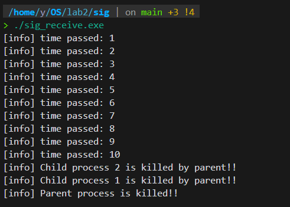

但是如果在时间内键盘按下 `Ctrl + \`， 向父进程发出信号
`SIGQUIT`, 则父进程会退出，但是子进程不会打印。
经过查阅, `Ctrl + \`终端会向所有现在运行中的前台进程发送 `SIGQUIT`, 因此子进程直接退出，不会执行其剩下的语句
。在子进程里加上
```cpp
    signal(SIGQUIT, SIG_IGN);
```
使其忽略 `SIGQUIT` 信号后问题解决.

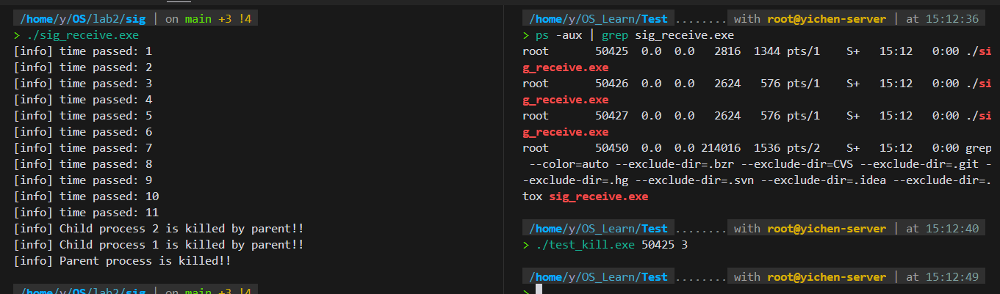
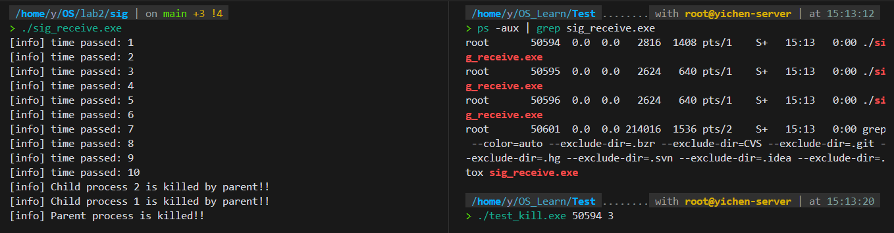

---

### 管道通信

根据所给代码补充完在父(子)进程中读写的部分代码
```cpp
        lockf(fd[1],1,0);
        for (int i = 0; i < (BUFFER_SIZE - 1) / 2; ++i)
        {
            write(fd[WRITE_END], c1, 1);
        }
        lockf(fd[1],0,0);         
        sleep(2); 

        // **************************

        lockf(fd[1],1,0);                 
        for (int i = 0; i < (BUFFER_SIZE - 1) / 2; ++i)
        {
            write(fd[WRITE_END], c2, 1);
        }
        lockf(fd[1],0,0); 
        sleep(2);     

        // *****************************

        wait(NULL);
        lockf(fd[0],1,0);  
        ssize_t size = read(fd[READ_END], InPipe, BUFFER_SIZE - 1);
        if(size > 0)
            InPipe[size] = '\0';
        else if(size == 0)
            printf("quit\n");
        else
            printf("error\n");
        lockf(fd[0],0,0);  
        printf("%s\n",InPipe);    
```

在父进程中，如果去掉lockf函数
```cpp
    // lockf(fd[0],1,0); 
    // .............
    // lockf(fd[0],0,0);  
```

则管道读写的互斥和同步出现问题，输出结果如下:
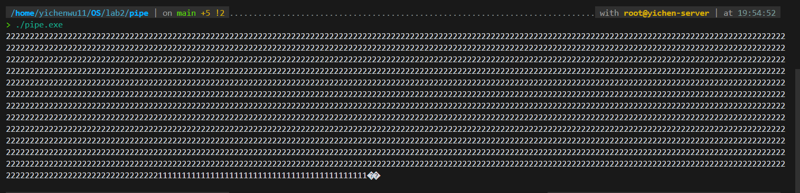

加上lockf函数后读写正常
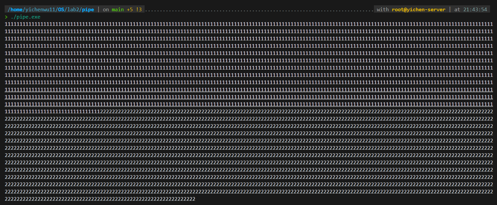

---

## Part2 内存分配与回收

实现该部分实验主要有两个类
<br/>
`VarSizeAllocMngr` ---> 可变长度分配Manager
<br/>
`Allocator` ---> 继承自 `VarSizeAllocMngr`, 并且包装了对于"进程"pid的管理.

---

### *VarSizeAllocMngr*

该类的核心成员如下，其中对于每一个分配`(Allocation)`用一个偏移`(Offset)`和长度`(Size)`来表示, 类似 `std::span`, 对每一个空闲块`(FreeBlock)`也同样如此

```cpp
    using OffsetType = int;

    struct FreeBlockInfo;

    // Type of the map that keeps memory blocks sorted by their offsets
    using TFreeBlocksByOffsetMap = std::map<OffsetType, FreeBlockInfo>;

    // Type of the map that keeps memory blocks sorted by their sizes
    using TFreeBlocksBySizeMap = std::multimap<OffsetType, TFreeBlocksByOffsetMap::iterator>;       

    using AllocatedMap = std::map<OffsetType, OffsetType>; 

    struct FreeBlockInfo {
        // Block size (no reserved space for the size of allocation)
        // actually Size == OrderBySizeIt->first
        OffsetType Size;
        // Iterator referencing this block in the multimap sorted by the block size
        TFreeBlocksBySizeMap::iterator OrderBySizeIt; 

        FreeBlockInfo(OffsetType _Size) : Size(_Size) {}
    };
```

其中有三个核心成员
```cpp
    TFreeBlocksByOffsetMap m_FreeBlocksByOffset;
    TFreeBlocksBySizeMap m_FreeBlocksBySize;
    AllocatedMap m_Allocated;
```

* `m_FreeBlocksByOffset`记录每个空闲块, 其索引为空闲块的偏移(即起点).
* `m_FreeBlocksBySize`其索引为空闲块的大小, 其类型是一个 `std::multimap<...>`, 使用 `multi` 是因为不同空闲块的大小可能一致，在此 map 中保存的块是按大小从小到大排序的，可以用于后续实现三种不同算法的 `Allocate`
* `m_Allocated` 是一个 `std::map<OffsetType, OffsetType>`, 记录了目前所有已分配的块, 其索引为块的 `Offset`, 值为块的 `Size`
<br/>

三种 Allocate 的实现:
<br/>
* FF：遍历 `m_FreeBlocksByOffset`, 在容量足够的第一个块中分配
* BF: 使用 `lower_bound(xxx)` 在 `m_FreeBlocksBySize` 中找到最小的容量足够的块，在其中分配即可
* WF: 与 BF 恰好相反

Free的实现:
<br/>
* 需要考虑在释放块时，该空闲块能不能与其紧挨的之前的空闲块合并，后者与之后的紧挨的空闲块合并。多判断几种情况即可

---

### *Allocator*

其核心数据成员如下:
```cpp
    std::set<int> ChildPidList;
    std::map<int, std::set<int>> Pid2Offsets;
```

记录了所有存在的子进程的pid以及其该进程所占有的分配块,
`Pid2Offsets`键值对中的值为块的`Offset`,根据该偏移即可在 `VarSizeAllocMngr` 中的 `m_FreeBlocksByOffset` 里查到该块的长度
<br/>
核心方法如下:
```cpp
    int AddProcessAndAllocate(int size, Option option = Option::BF);

    int Allocate(int size, Option option = Option::BF);

    void NotDelProcessAndFree(pid_t pid, int offset, int size);

    void DelProcessAndFree(pid_t pid);

    void OutputGraph();

    void Free(pid_t pid, OffsetType Offset, OffsetType Size);
```

通过枚举类
```cpp
    enum class Option : uint8_t
    {
        FF = 0,
        BF,
        WF
    };
```
来设置不同的分配算法.

---

### *运行展示*

菜单界面
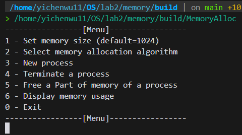

<br/>
如果没有调用 `1`,即分配内存总大小就调用其他，则会提示
Initilize the allocator first!!!

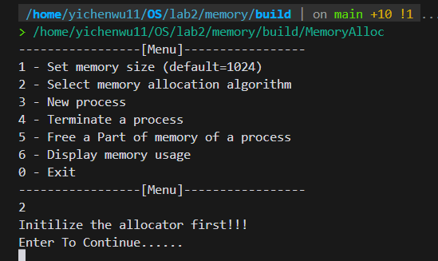

<br/>
设置内存为`1024`

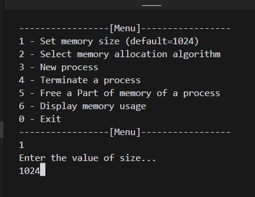

<br/>
创建一个进程内存大小为100

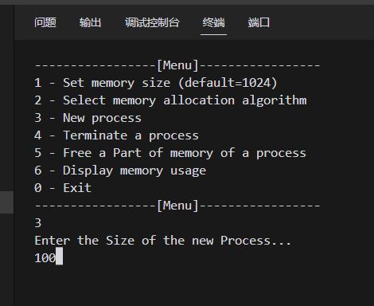

<br/>
创建一个进程内存大小为800

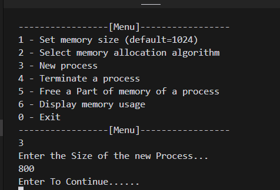

<br/>
目前内存布局如下

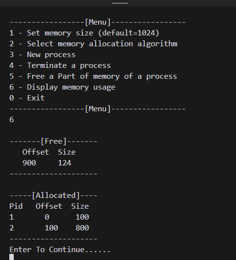

<br/>
把进程2的内存中 (300 --> 500)的部分释放

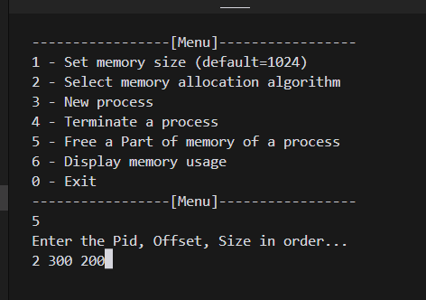

<br/>
内存布局如下，可以看到进程2目前占有两个块


<br/>
把进程2的内存中 (500 --> 800)的部分释放

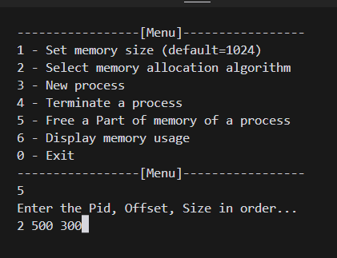

<br/>
目前内存布局如下

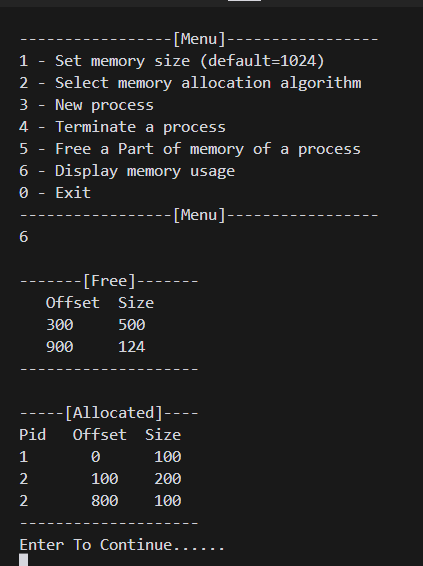

<br/>
设置算法为 BF

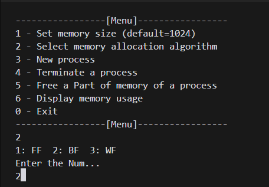

<br/>
分配一个大小的100的进程

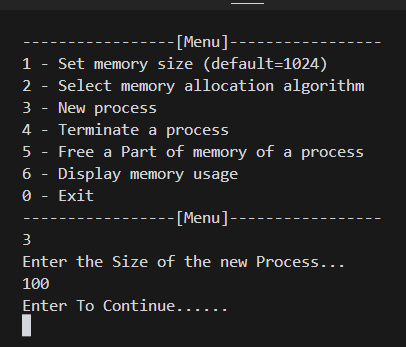

<br/>
内存布局如下，可以看到采用了 BF 算法，选择了最小的块, 即后面的那个块去分配这 100 的大小

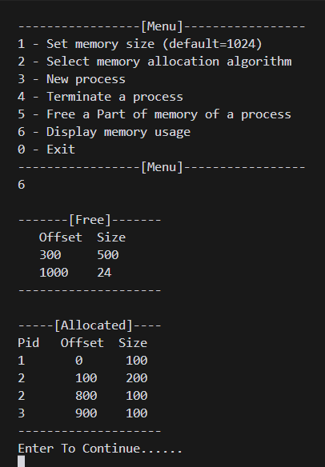

<br/>
设置算法为FF

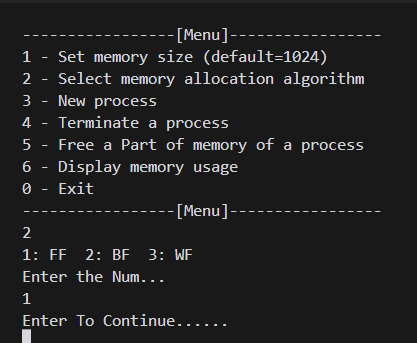

<br/>
分配一个大小为10的进程，可以看到根据 FF 算法，内存分配在了最前面的块里

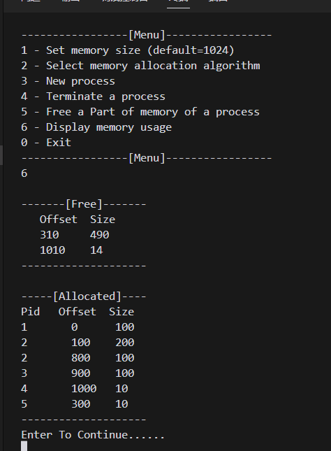

<br/>
设置为 WF 算法，可以看到分配在了最大的块里

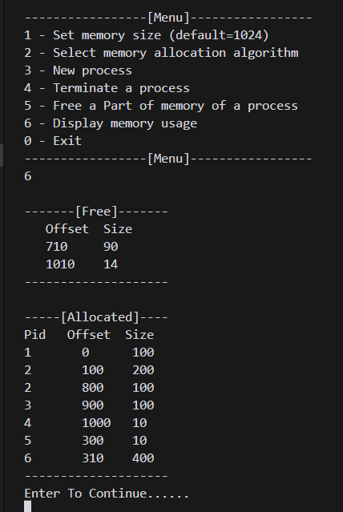

<br/>
终止进程1

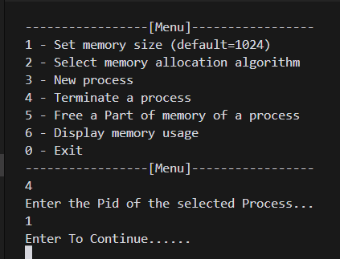

<br/>
查看内存布局如下，可以看到进程1的内存已经被全部释放

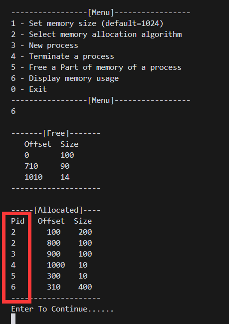

---

## Part 3 遇到的问题

在管道程序中，由于 `alarm(5)`, 因此 5s 后父进程收到软中断信号 `SIGALRM`, 父进程向子进程发送信号，子进程接收信号后退出，父进程随之退出，输出如下:


但是如果在时间内键盘按下 `Ctrl + \`， 向父进程发出信号
`SIGQUIT`, 则父进程会退出，但是子进程不会打印。
经过查阅, `Ctrl + \`终端会向所有现在运行中的前台进程发送 `SIGQUIT`, 因此子进程直接退出，不会执行其剩下的语句
。在子进程里加上
```cpp
    signal(SIGQUIT, SIG_IGN);
```
使其忽略 `SIGQUIT` 信号后问题解决.


---

## Part 4 分析和思考

* 在写程序时要注意设计以及功能模块的划分，对于每一个功能要考虑各种情况，保证程序的健壮性.

---

## Part 5 Score

自评分: 30
