# OS_Lab3

## Part1 FileSystem_Ext2

### ***Intro***

Ext2的磁盘布局使用了组块的结构, 并且采用了多级索引使得单文件的大小得到了很大的提升.

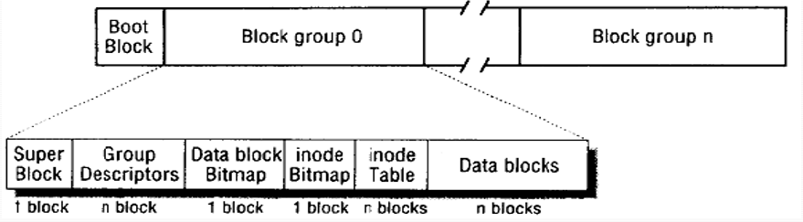

在实现基于文件空间的类Ext2文件系统时，需要注意一下三个部分:

1. 使用单文件空间来模拟整个磁盘空间
2. 组织ext2系统所提供的各种功能以及其数据结构
3. 为用户提供shell和操作接口

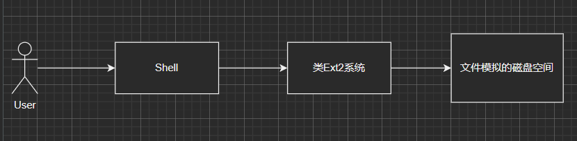

<br/>

解决方案如下:

1. 使用 `fseek` + `fwrite/fread` 模拟磁盘的读取和写入以及定位
2. 实现 `Ext2` 类来抽象 Ext2 文件系统
3. 实现 `Shell` 类并组合 `Ext2` 来向用户提供 Shell界面和接口操作

在此次实验中，为了简化，假定:

1. 只有一个组(Group), 即只有一个组描述符
2. 只有一个用户, 用户相关实现末节都可以忽略
3. 逻辑块大小与物理块大小均定义为 `512Byte`

简化后的文件系统布局如下:

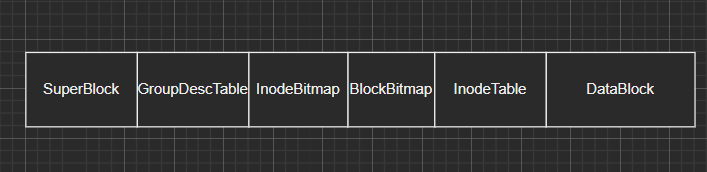

<br/>

---

### ***Analysis***

简化后的文件系统结构很简单, 其中关键在于从文件名到实际数据块的映射, 大体上是这样一个顺序:

```shell
  File/Dir_Name ------> Inode ------> DataBlock(s)
```

其中每个 Inode 可能是从一个文件映射而来, 也可能是从一个目录映射而来, 二者之间的区别在于:

* 文件的 Inode 直接指向可以指向其所占有的所有数据块, 其中 i_blocks字段的前六位数据为直接索引, 即直接指向数据块; 第七位数据为一个一级间接索引, 第八位数据为一个二级间接索引; 数据块存放的就是文件的内容.
* 目录的 Inode 也是指向数据块, 其与文件的不同之处在于, 数据块中存储的是很多个 `dir_entry`, 即目录项; 对于每个目录项, 如果 `file_type` 为 `FileType::DIR`, 则形成一个树形结构, 如果是文件则成为一个叶子结点, 指向其文件实际内容所在的数据块

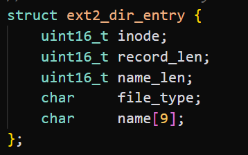


---

### ***Impl***

`Ext2` 类的实现, 主要提供了一系列底层的操作给 `Shell`

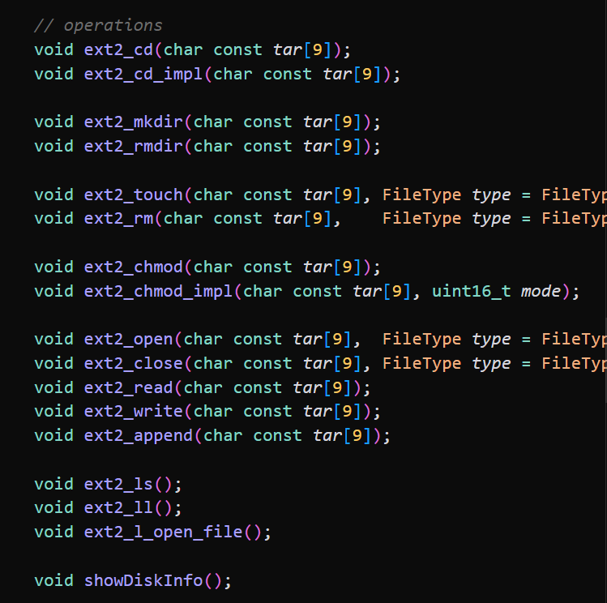

`Shell` 类主要只需要做两件事:
```shell
  UserInput ---> Params -----> ActualOp
```
把用户操作转成 `op + params + target` 的形式, 然后调用 `Ext2` 的相关操作即可.

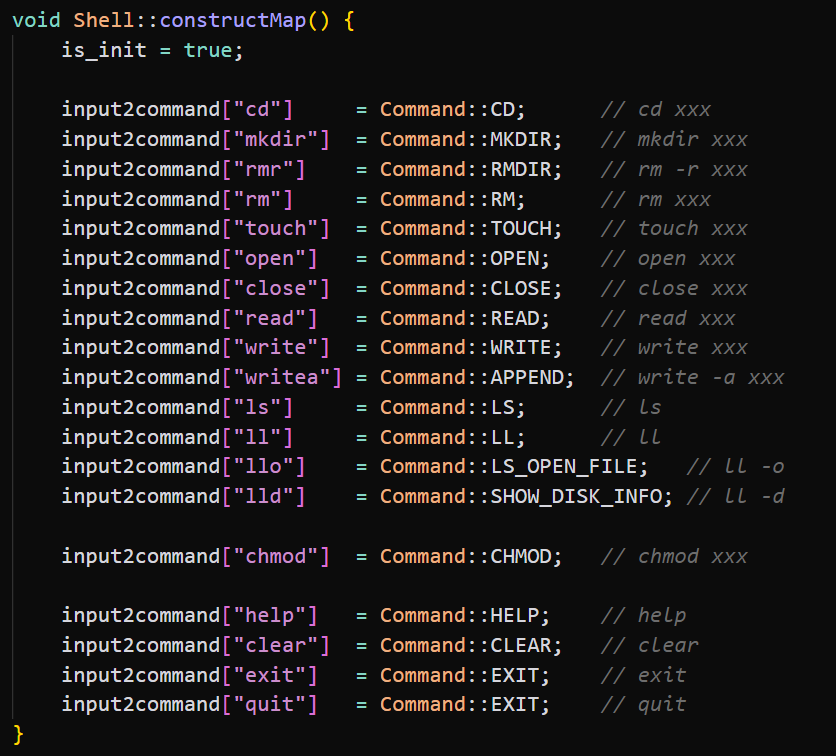

---

### ***Run***

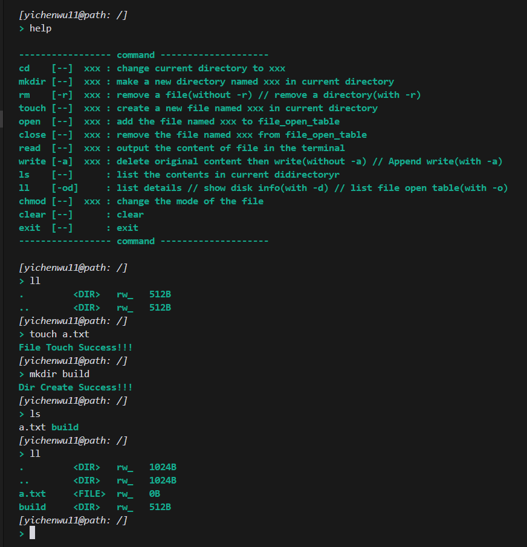

---

## Part2 Thread Pool Impl

### ***intro***

使用 `std::thread` + `std::future` + `std::promise`等标准库以及模板元编程, 类型萃取等技术来实现一个**可复用**的线程池实现.

### ***run***

工具类 `A`

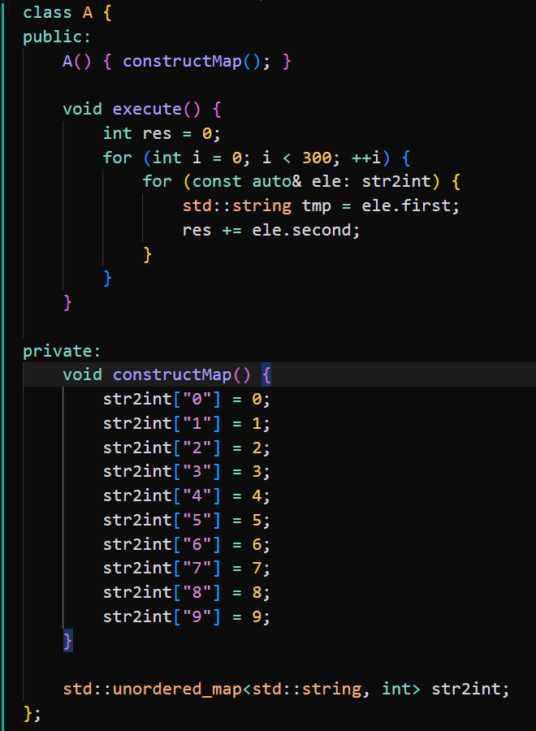

No_ThreadPool_Func

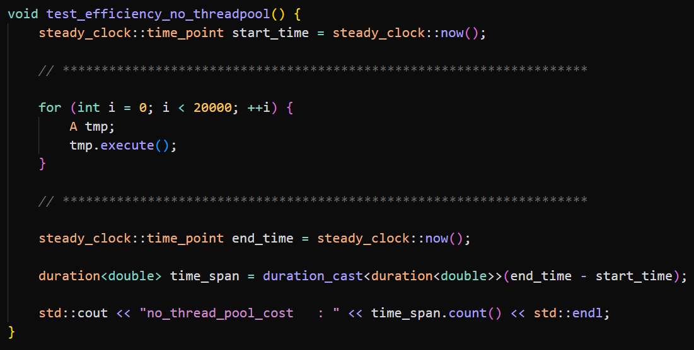

With_ThreadPool_Func

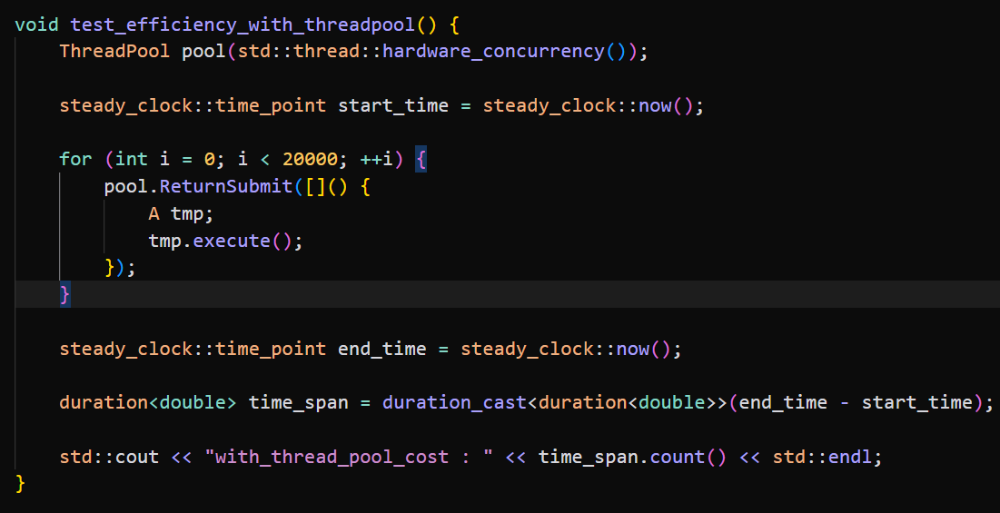

***Result***

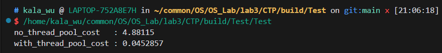

可以看到并行版本的效率提升非常明显.

---

## Part 3 遇到的问题

线程池实现中为了确保函数对象的唯一性, 引入了 [Naops/function2](https://github.com/Naios/function2).

---

## Part 4 分析和思考

在写程序时要注意设计以及功能模块的划分，对于每一个功能要考虑各种情况，保证程序的健壮性.

---

## Part 5 自评分

`Score: ` $30$

